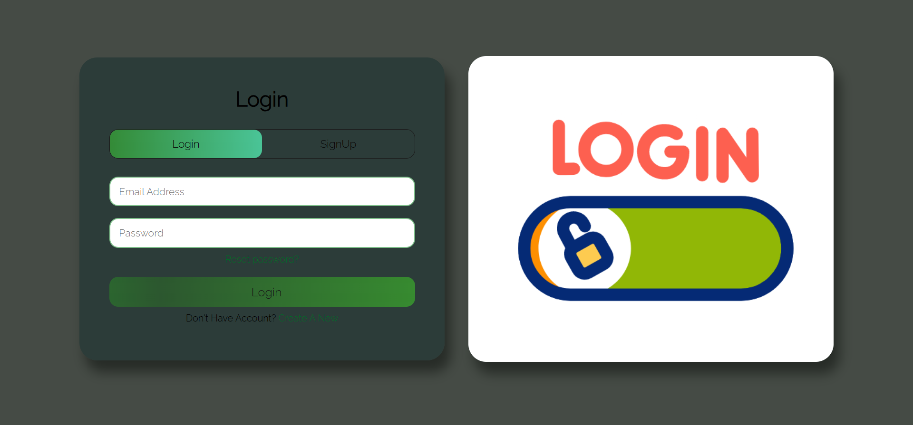

# Login-Signup-Page
A responsive and user-friendly Login and Signup Page built using HTML, CSS, and JavaScript. This project demonstrates basic frontend development skills, including form validation, interactive UI, and dynamic content switching between login and signup forms. Ideal for beginner-level practice in frontend web development.

## 🔗 Live Demo
[Click here to view the project](https://ankitrathore8749.github.io/Login-Signup-Page/)

## 📸 Screenshot
